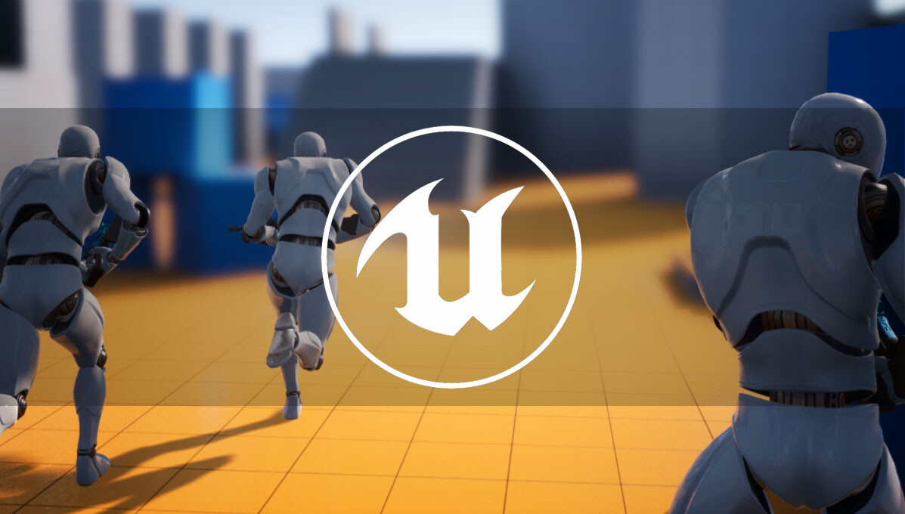

# Third-person Coop Shooter

Project for Third-person Co-op Shooter Game built in Unreal Engine 4 with c++ and networking.

## Features

	- Third-Person Character
	- Weapon Code for hitscan and projectile weapons
	- AI 'tracker ball' like Gears of War
	- Power-up system
	- Enemy AI Spawning using 'Environment Query System'
	- Horde-mode wave spawning of enemy AI
	- AI Bot using hitscan weapon, behavior trees, EQS and custom nodes
	- ActorComponent for Health in any Actor like AI, Player, ...
	- UMG UI
	
## In console (¸) type:

	- Host a Match: open LevelName?Listen (open P_Blockout?Listen)
	- Join a Match: open host.public.ip.number:7777 (open 169.254.4.117:7777)
	
**Unreal Engine 4 Version: 4.27**

